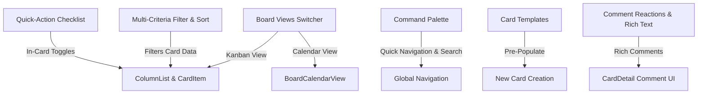

# Trello-Lite: Proposed UX & UI Product Roadmap

This document outlines 6 premium, user-focused feature proposals designed to elevate the User Experience & Interface (UX/UI) of **Trello-lite**, utilizing your existing MERN stack, Socket.io real-time engine, and Recharts configuration.

---

---

## 1. Board Views Switcher (Kanban Board vs. Calendar Grid)

### Problem Solved
Currently, cards have due dates, but users cannot visualize deadlines, schedules, or team milestones over time. Cards are scattered across columns, making it difficult to spot scheduling conflicts or timeline bottlenecks.

### Structural Integration
Introduce a tabbed view controller in the `BoardPage` header.
- **Kanban View**: Renders the existing column-based drag-and-drop layout.
- **Calendar View**: Renders a monthly/weekly calendar grid. Cards from the board's store are mapped to their respective calendar cells based on `dueDate`. 
- **Drag & Drop**: Users can drag cards across calendar cells to instantly update their due dates, which triggers the existing `updateCard` API and broadcasts the update to other active board viewers via Socket.io.

* **Effort Estimate**: **Hard**
* **Files to Create or Modify**:
  * **Modify**: `frontend/src/pages/BoardPage.jsx` (Add view toggle controls and render conditional views)
  * **Create**: `frontend/src/components/Board/BoardCalendarView.jsx` (Calendar grid logic, populating cards on specific date cells, handling calendar drag-and-drop actions)

---

## 2. Multi-Criteria Filter & Sort Control Panel

### Problem Solved
The current board search is limited to basic title keyword filters and a single-label selection dropdown. Users cannot perform advanced queries like:
- Finding cards assigned to specific colleagues.
- Highlighting only overdue cards or cards due this week.
- Sorting cards within columns by due date, title, or creation date.

### Structural Integration
Introduce an expandable/collapsible glassmorphic sidebar panel above the columns. It will allow multi-selection checkboxes for Assignees, Labels, Due Date status, and a Sort dropdown (e.g., "Due Date: Soonest First", "Title: A-Z"). The sorting and filtering logic runs client-side on the board state inside `BoardPage.jsx` before passing the filtered list of cards to `ColumnList`, ensuring instantaneous rendering with zero extra database queries.

* **Effort Estimate**: **Medium**
* **Files to Create or Modify**:
  * **Modify**: `frontend/src/pages/BoardPage.jsx` (Apply multi-criteria filtering/sorting logic to the local state before passing cards)
  * **Create**: `frontend/src/components/Board/FilterSortPanel.jsx` (Interactive checkbox group and dropdown panel UI)

---

## 3. In-Card Quick-Action Checklist Dropdown

### Problem Solved
Checking off subtasks or adding a quick checklist checkpoint currently requires clicking on the card, waiting for the full `CardDetail` modal to render, toggling the item, and clicking save. This creates unnecessary friction for rapid task updates.

### Structural Integration
Modify `CardItem.jsx` to render a small checklist status indicator/progress bar that is interactive. 
- Hovering over the card progress bar reveals a dropdown toggle button.
- Clicking the toggle opens an inline card popover showing checklist check-boxes.
- Toggling a checkbox directly sends a patch update using the existing client-side `updateCard` API and fires the Socket.io `card:update` event, updating all client views in real-time without ever opening the modal.

* **Effort Estimate**: **Easy**
* **Files to Create or Modify**:
  * **Modify**: `frontend/src/components/Card/CardItem.jsx` (Embed mini checklist view, toggle states, and integrate update API trigger)

---

## 4. Universal Command Palette (`Ctrl + K` / `Cmd + K`)

### Problem Solved
Navigating between workspaces, searching for cards, changing dashboards, or updating theme settings requires clicking through menus. It feels sluggish for power users.

### Structural Integration
Create a global portal modal managed in the layout wrapper. Pressing `Cmd + K` or `Ctrl + K` triggers an overlay where users can search for and select matching:
- Workspaces and boards (to quickly switch views).
- Specific cards assigned to them.
- Quick actions (e.g., "Toggle Dark Mode", "View Profile Settings", "Create New Workspace", "Logout").

* **Effort Estimate**: **Medium**
* **Files to Create or Modify**:
  * **Create**: `frontend/src/components/Layout/CommandPalette.jsx` (Fuzzy-search modal index, active navigation, search list rendering)
  * **Modify**: `frontend/src/components/Layout/Navbar.jsx` (Listen for hotkeys and render the command palette)

---

## 5. Card Templates for Standardized Workflows

### Problem Solved
Teams often create cards for recurring activities (e.g., "Code Review Checkpoint", "Weekly Team Sync", "Onboarding checklist") and must manually type the description markdown, re-add labels, and build checklists from scratch every single time.

### Structural Integration
Add template capabilities:
1. In `CardDetail.jsx`, add a "Save as Template" button next to save/delete actions. This flags the card or clones it as a blueprint in the database.
2. In `ColumnItem.jsx`, next to the standard "Add Card" input, render a template picker icon. Selecting a template automatically clones description markdown, labels, and checklist items into the new card.

* **Effort Estimate**: **Hard**
* **Files to Create or Modify**:
  * **Modify**: `backend/src/models/Card.js` (Add `isTemplate: { type: Boolean, default: false }` field)
  * **Modify**: `backend/src/controllers/cardController.js` & `backend/src/routes/card.routes.js` (Add endpoints to save/fetch card templates)
  * **Modify**: `frontend/src/api/card.api.js` (Define template retrieval and creation client wrappers)
  * **Modify**: `frontend/src/components/Card/CardDetail.jsx` (Add template configuration option)
  * **Modify**: `frontend/src/components/Column/ColumnItem.jsx` (Integrate template creation selector dropdown)

---

## 6. Collaborative Comment Reactions & Rich Text Markdown Editor

### Problem Solved
Communication in card details is plain text only. Team members cannot highlight items, insert bullet lists, or express simple emotions (like 👍, ❤️, or 👀) on card updates, which leads to cluttering the comments thread with one-word replies.

### Structural Integration
1. **Rich Comments**: Enable Markdown rendering inside the comments section using `ReactMarkdown` (which is already configured in your dependencies).
2. **Reactions**: Add an emoji reaction array to each comment object in the MongoDB `Card` model. Render an inline reaction bar below comments inside `CardDetail.jsx`. Clicking an emoji triggers a background route updating the reaction and syncs via Socket.io so team members see reactions float in in real-time.

* **Effort Estimate**: **Medium**
* **Files to Create or Modify**:
  * **Modify**: `backend/src/models/Card.js` (Update the comments schema to include a sub-document array `reactions: [{ emoji: String, users: [{ type: ObjectId, ref: 'User' }] }]`)
  * **Modify**: `backend/src/controllers/cardController.js` (Implement controller actions to push/pull reactions from comment arrays)
  * **Modify**: `backend/src/routes/card.routes.js` (Register comment reactions endpoint)
  * **Modify**: `frontend/src/components/Card/CardDetail.jsx` (Add emoji selector, display active reactions, and wrap comments in `<ReactMarkdown>`)
